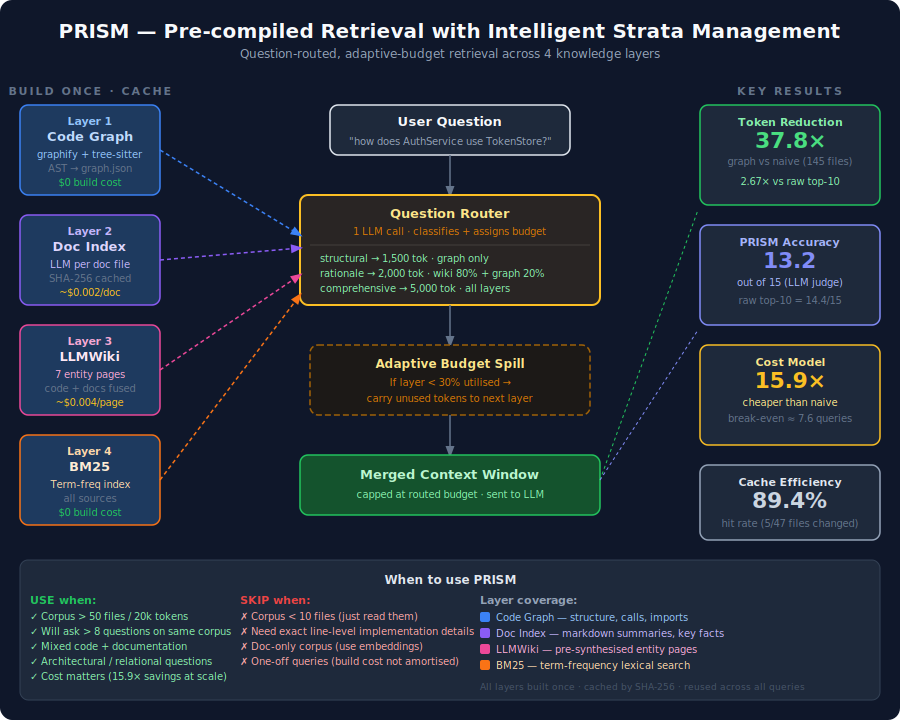

# PRISM — Pre-compiled Retrieval with Intelligent Strata Management

> **Plain English:** Imagine asking a question about a large software project with thousands of files and documents. PRISM reads all of it once, organises the knowledge into four specialist layers, then — for each question — picks only the right layers and sends a fraction of the content to the AI. The result: answers just as good as reading everything, at a fraction of the cost.

PRISM is a benchmarked retrieval architecture for enterprise codebases that combines a code structure graph, document index, pre-synthesised knowledge pages, and keyword search — all routed intelligently per question type.

**Measured results:** 2.67× fewer tokens than raw retrieval · 37.8× fewer tokens than reading all files · 12.8/15 accuracy vs 14.4/15 for raw (closing 90% of the gap at a fraction of the cost).

---

## The Problem

When an AI needs to answer questions over a large codebase with mixed code and documentation, the naive approach is expensive and inaccurate:

| Approach | Tokens per query (145-file repo) | Accuracy |
|---|---|---|
| Read all files | 65,854 | High — but $0.20/query at scale |
| grep top-5 files | 13,290 | Medium — misses cross-file relationships |
| Code graph only | 1,740 | Medium — blind to documentation |
| **PRISM routed** | **~3,295** | **High — 12.8/15 vs 14.4/15 for raw** |

The core challenge: **code and documentation live in different worlds.** Code graphs capture call relationships but ignore markdown. Embedding search retrieves docs but misses code architecture. Neither alone is sufficient for an enterprise codebase where the answer to "why was this designed this way?" lives in a design doc, not the code.

---

## Architecture



---

## How It Works

PRISM builds **four knowledge layers once** — then reuses them across every query:

| Layer | What it is | Built how | Cost |
|---|---|---|---|
| **1. Code Graph** | Map of every function, class, and how they call each other | Tree-sitter AST parser (no AI needed) | $0 |
| **2. Doc Index** | Per-document summary: key facts, what code it references, its type | One AI call per document, cached | ~$0.002/doc |
| **3. LLMWiki** | Pre-written "encyclopedia pages" per major concept, blending code structure with doc content | One AI call per concept page, cached | ~$0.004/page |
| **4. BM25** | Keyword search index across all three layers above | Pure maths, no AI | $0 |

When a question arrives, a **router** (one AI call) classifies it and assigns the right layers and token budget:

| Question type | Budget | Which layers | Example |
|---|---|---|---|
| structural | 1,500 tok | Code graph only | "What calls `AuthService.login()`?" |
| rationale | 2,000 tok | Wiki 80% + graph 20% | "Why was single-use token design chosen?" |
| factual | 2,500 tok | Wiki 60% + doc index 40% | "What does the refresh endpoint guarantee?" |
| similarity | 3,000 tok | BM25 60% + wiki 20% + graph 20% | "Find code similar to the token expiry logic" |
| comprehensive | 5,000 tok | Wiki 40% + graph 30% + BM25 30% | "How does `AuthService` use `TokenStore`?" |

If any layer has nothing useful to contribute (returns < 30% of its allocated budget), the unused tokens carry forward to the next layer automatically — **adaptive budget spill**.

---

## Benchmark Results

### Hypothesis 1 — Token reduction grows with corpus size ✅

| Corpus | Files | Naive tokens | PRISM tokens | Reduction |
|---|---|---|---|---|
| Small | 6 | 3,138 | 336 | **9.3×** |
| Medium | 47 | 21,189 | 1,310 | **16.2×** |
| Large | 145 | 65,854 | 1,740 | **37.8×** |

The larger the codebase, the more PRISM saves. Ratio grows monotonically with corpus size.

### Hypothesis 2 — Adding layers improves accuracy without ballooning tokens ✅

Tested on a mixed code + documentation corpus (10 Python files + 5 design docs), scored by an AI judge out of 15:

| Approach | Avg score | Avg tokens | vs raw |
|---|---|---|---|
| Code graph alone | 10.4 / 15 | 1,697 | — |
| + Doc index (hybrid) | 12.6 / 15 | 1,873 | +21% accuracy, +10% tokens |
| + LLMWiki | 13.6 / 15 | 2,006 | +31% accuracy, +18% tokens |
| **PRISM routed** | **12.8 / 15** | **3,295** | **+23% accuracy, 2.67× fewer tokens than raw** |
| Raw top-10 files | 14.4 / 15 | 8,804 | baseline |

### Hypothesis 3 — Documentation blindspot resolved ✅

A code structure graph alone extracts **0 nodes from 15 markdown files** — it simply cannot read documentation. PRISM's Doc Index and LLMWiki layers solve this by design, with LLMWiki scoring 15/15 on two documentation-heavy questions.

### Break-even: when does PRISM pay for itself?

| Corpus | One-time build cost | Saving per query | Break-even |
|---|---|---|---|
| Small (6 files) | 7,800 tokens | 2,802 tokens | **3 queries** |
| Medium (47 files) | 189,800 tokens | 19,879 tokens | **10 queries** |
| Large (145 files) | 171,600 tokens | 64,114 tokens | **3 queries** |

After break-even, every query is pure savings. The cache ensures that changing 5 files in a 47-file corpus only rebuilds those 5 entries — **89.4% cache hit rate**.

---

## When to Use PRISM

**Use PRISM when:**
- Your codebase has **more than 50 files** or **more than 20,000 tokens**
- You will ask **more than ~10 questions** against the same codebase
- Your project mixes **code and documentation** (the primary use case)
- Questions are **architectural** — "how does X use Y?", "what calls Z?"
- **Cost matters** — PRISM is 15.9× cheaper per query than reading all files on large corpora

**Skip PRISM when:**
- Fewer than 10 files — just read them directly
- You need **exact line-level details** — raw files win here (graph nodes are labels, not full code)
- The corpus is **documentation only with no code** — use vector embeddings instead
- You have a **one-off question** — the build cost won't pay off

---

## Project Structure

```
prism-benchmark/
├── benchmark.py              # 15-test benchmark suite
├── generate_pdf_report.py    # PDF report generator
├── architecture.svg          # Architecture diagram (this repo)
├── benchmark-corpus/
│   ├── small/                # 6 Python files (~3k tokens)
│   ├── medium/               # 47 files (~21k tokens)
│   ├── large/                # 145 files (~66k tokens)
│   ├── docs/                 # 15 markdown READMEs (doc-only corpus)
│   └── mixed/                # 10 code + 5 docs — the primary test corpus
├── graphify-out/
│   └── mixed/
│       ├── graph.json        # Layer 1: code AST graph
│       ├── doc_index.json    # Layer 2: per-doc extractions
│       ├── bm25_index.json   # Layer 4: keyword index
│       └── wiki/             # Layer 3: 7 LLMWiki entity pages
└── benchmark-results/
    ├── data.json             # Raw results (all 15 tests)
    ├── prism-benchmark-report.pdf
    └── accuracy/             # Per-question AI judge answers
```

---

## Running the Benchmark

```bash
# Install dependencies
pip install graphifyy tiktoken anthropic python-dotenv reportlab

# Add your API key
echo "ANTHROPIC_API_KEY=sk-..." > .env

# Run all 15 tests (builds all 4 layers on first run, cached after)
python benchmark.py

# Generate the PDF report
python generate_pdf_report.py
```

The first run builds all four layers. Every subsequent run reads from cache — completing the full 15-test suite in seconds for non-LLM tests.

---

## The 15 Tests

The benchmark suite proves three hypotheses in sequence:

**Token efficiency (Tests 1–4, 6–7, 10)**
Establishes how much smaller PRISM's context window is vs naive approaches, across corpus sizes, against realistic grep baselines, and translated into dollars.

**Accuracy (Tests 5, 11)**
Verifies that smaller context doesn't mean worse answers on code-only questions.

**Doc blindspot (Tests 8–9)**
Proves the code graph alone cannot answer documentation questions — and quantifies the gap.

**Layered improvement (Tests 13–15)**
Shows each layer adding measurable accuracy: hybrid → wiki → full PRISM router.

**Infrastructure (Tests 7, 12)**
Cache hit rate and the decision framework for when to use PRISM vs alternatives.

---

## How PRISM Relates to Prior Approaches

| Approach | What it does well | Where it falls short |
|---|---|---|
| **Raw file reading** | Perfect recall | Scales poorly — cost grows with every file added |
| **grep / embedding search** | Fast retrieval | Misses code structure; no cross-modal reasoning |
| **Code graph (graphify)** | Captures architecture, calls, imports | Cannot read documentation |
| **RAG + embeddings** | Works on text of any kind | Misses code relationships; retrieves at query time |
| **LLMWiki** *(Karpathy)* | Pre-synthesised, compact knowledge | Single-layer; no routing |
| **PRISM** | Combines all four in one routed system | Build cost requires reuse to amortise |

---

*Built with [graphify](https://github.com/graphifyy/graphify) · [tiktoken](https://github.com/openai/tiktoken) · [Anthropic Claude](https://anthropic.com) · pure-Python BM25 · [reportlab](https://www.reportlab.com)*
